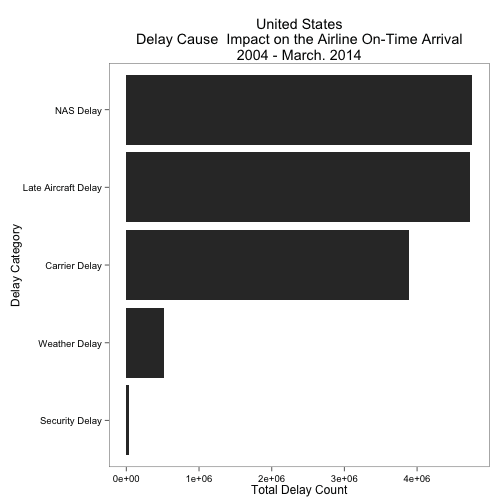
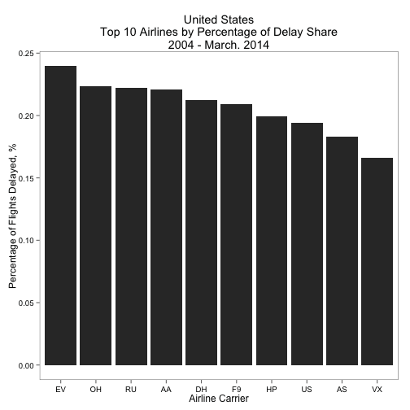
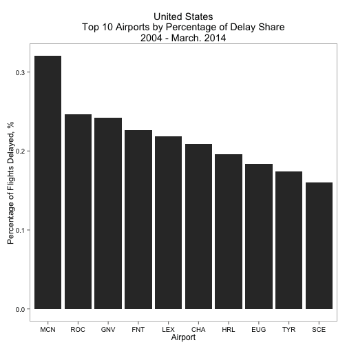
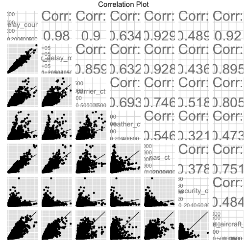

Exploratory Data Analysis - Airline Delay Causes
========================================================


```r
library(ggplot2)
library(ggthemes)
library(data.table)
library(GGally)
```


```r
data <- read.csv("../data/airline_delay_causes.csv")
str(data)
```

```
## 'data.frame':	175104 obs. of  23 variables:
##  $ X                  : int  1 2 3 4 5 6 7 8 9 10 ...
##  $ year               : int  2004 2004 2004 2004 2004 2004 2004 2004 2004 2004 ...
##  $ month              : int  1 1 1 1 1 1 1 1 1 1 ...
##  $ carrier            : Factor w/ 25 levels "9E","AA","AQ",..: 2 2 2 2 2 2 2 2 2 2 ...
##  $ carrier_name       : Factor w/ 26 levels "AirTran Airways Corporation",..: 5 5 5 5 5 5 5 5 5 5 ...
##  $ airport            : Factor w/ 367 levels "ABE","ABI","ABQ",..: 3 23 25 30 36 43 45 56 57 73 ...
##  $ airport_name       : Factor w/ 367 levels "Aberdeen, SD: Aberdeen Regional",..: 8 19 22 138 35 235 39 47 24 68 ...
##  $ arr_flights        : int  275 704 793 368 93 453 1431 124 513 119 ...
##  $ arr_del15          : int  91 242 187 97 20 114 357 33 116 41 ...
##  $ carrier_ct         : num  32.5 40.8 54.5 29 10.3 ...
##  $ weather_ct         : num  10.97 23.82 23.67 13.12 1.64 ...
##  $ nas_ct             : num  15.66 115.8 40.09 19.91 2.27 ...
##  $ security_ct        : num  0 0 0 0 0 0 0 0 0 0 ...
##  $ late_aircraft_ct   : num  31.9 61.56 68.76 34.97 5.83 ...
##  $ arr_cancelled      : int  1 13 17 13 0 13 77 1 25 9 ...
##  $ arr_diverted       : int  1 0 0 0 0 1 2 0 0 1 ...
##  $ arr_delay          : int  4204 14470 9698 5928 788 5724 20914 1451 5189 2642 ...
##  $ carrier_delay      : int  1198 2327 2499 1869 409 1757 6898 838 1148 267 ...
##  $ weather_delay      : int  506 1457 1426 900 69 675 1796 151 958 636 ...
##  $ nas_delay          : int  546 5961 1398 716 63 745 3465 113 971 342 ...
##  $ security_delay     : int  0 0 0 0 0 0 0 0 0 0 ...
##  $ late_aircraft_delay: int  1954 4725 4375 2443 247 2547 8755 349 2112 1397 ...
##  $ V22                : logi  NA NA NA NA NA NA ...
```

```r
nrow(data)
```

```
## [1] 175104
```


## Transform delay counts into categorical variable


```r
data.delay <- data[which(data$arr_del15 > 0), ]
data.delay$season[data.delay$month %in% c(12, 1, 2)] <- "Winter"
data.delay$season[data.delay$month %in% c(3, 4, 5)] <- "Spring"
data.delay$season[data.delay$month %in% c(6, 7, 8)] <- "Summer"
data.delay$season[data.delay$month %in% c(9, 10, 11)] <- "Fall"


nrow(data.delay)
```

```
## [1] 171603
```


```r

dt <- data.table(data.delay)

dt.total <- dt[, list(tot_carrier_ct = sum(carrier_ct), tot_weather_ct = sum(weather_ct), 
    tot_nas_ct = sum(nas_ct), tot_sec_ct = sum(security_ct), tot_late_aircraft_ct = sum(late_aircraft_ct))]

dt.total <- dt.total[, list(delay_var = names(.SD), count = unlist(.SD, use.names = F))]

df.total <- as.data.frame(dt.total)
df.total$delay_category[df.total$delay_var == "tot_carrier_ct"] <- "Carrier Delay"
df.total$delay_category[df.total$delay_var == "tot_weather_ct"] <- "Weather Delay"
df.total$delay_category[df.total$delay_var == "tot_nas_ct"] <- "NAS Delay"
df.total$delay_category[df.total$delay_var == "tot_sec_ct"] <- "Security Delay"
df.total$delay_category[df.total$delay_var == "tot_late_aircraft_ct"] <- "Late Aircraft Delay"
```


### Analysis of the delay causes on the airline delays


```r
delay.causes <- ggplot(df.total, aes(x = reorder(delay_category, count), y = count)) + 
    theme_few() + scale_colour_few()
delay.causes <- delay.causes + geom_bar(stat = "identity") + coord_flip()
delay.causes <- delay.causes + ggtitle("United States\nDelay Cause  Impact on the Airline On-Time Arrival\n2004 - March. 2014") + 
    ylab("Total Delay Count") + xlab("Delay Category")

delay.causes
```

 


### Top 10 Airlines with most percentage of flight delays

```r
df.top10airlines <- dt[, list(perc_delay_air = sum(arr_del15)/sum(arr_flights)), 
    by = carrier]

df.top10airlines <- df.top10airlines[, `:=`(rank, order(-rank(perc_delay_air), 
    carrier))]

df.top10airlines <- df.top10airlines[rank <= 10]

top10.airlines_delay <- ggplot(df.top10airlines, aes(x = reorder(carrier, -perc_delay_air), 
    y = perc_delay_air)) + theme_few() + scale_colour_few()
top10.airlines_delay <- top10.airlines_delay + geom_bar(stat = "identity")
top10.airlines_delay <- top10.airlines_delay + ggtitle("United States\nTop 10 Airlines by Percentage of Delay Share\n2004 - March. 2014") + 
    ylab("Percentage of Flights Delayed, %") + xlab("Airline Carrier")

top10.airlines_delay
```

 


### Top 10 Airports with most percentage of flight delays

```r
df.top10airports <- dt[, list(perc_delay_air = sum(arr_del15)/sum(arr_flights)), 
    by = airport]
df.top10airports <- df.top10airports[, `:=`(rank, order(-rank(perc_delay_air), 
    airport))]
df.top10airports <- df.top10airports[rank <= 10]

df.top10airports_delay <- ggplot(df.top10airports, aes(x = reorder(airport, 
    -perc_delay_air), y = perc_delay_air)) + theme_few() + scale_colour_few()
df.top10airports_delay <- df.top10airports_delay + geom_bar(stat = "identity")
df.top10airports_delay <- df.top10airports_delay + ggtitle("United States\nTop 10 Airports by Percentage of Delay Share\n2004 - March. 2014") + 
    ylab("Percentage of Flights Delayed, %") + xlab("Airport")

df.top10airports_delay
```

 


```r
dt.pairs <- dt[, list(delay_count = arr_del15, arr_delay_min = arr_delay, carrier_ct, 
    weather_ct, nas_ct, security_ct, late_aircraft_ct)]

df.pairs <- as.data.frame(dt.pairs)

ggpairs(df.pairs, upper = list(params = c(size = 10)), lower = list(continuous = "smooth", 
    params = c(method = "loess", fill = "blue")), legends = TRUE, title = "Correlation Plot")
```

 


